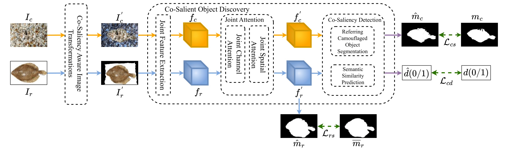

<!-- # CIRCOD - Official Pytorch Implementation (WACV 2025) -->
<div align="center">
<h1>Official Pytorch Implementation of CIRCOD: 

Co-Saliency Inspired Referring Camouflaged Object Discovery </h1>
Avi Gupta, Koteswar Rao Jerripothula, Tammam Tillo <br />
Indraprastha Institute of Information Technology, Delhi, India</sub><br />

Accepted in WACV 2025 <br />

<!--[]() -->


</div>

## Preparation

### Requirements

- torch>=2.0.0


### Datasets

We use the [COD10K](), [NC4K](), [CAMO](), [R2C7K]() and proposed [Ref-1K]() for evaluation.

```
data_root/
   ├── COD10K/
   │   ├── Images/
   │   ├── GT
   └── NC4K
   │   ├── Images/
   │   ├── GT
   ├── CAMO/
   │   ├── Images/
   │   ├── GT
   ├── R2C7K/
   │   ├── Camo/
   │   ├── Ref
   ├── Ref-1K/
   │   ├── Images/
   │   ├── GT
```

## Citation

```
@InProceedings{Gupta_2025_WACV,
    author    = {Gupta, Avi and Jerripothula, Koteswar Rao and Tillo, Tammam},
    title     = {CIRCOD: Co-Saliency Inspired Referring Camouflaged Object Discovery},
    booktitle = {Proceedings of the Winter Conference on Applications of Computer Vision (WACV)},
    month     = {February},
    year      = {2025},
    pages     = {8302-8312}
}
```
